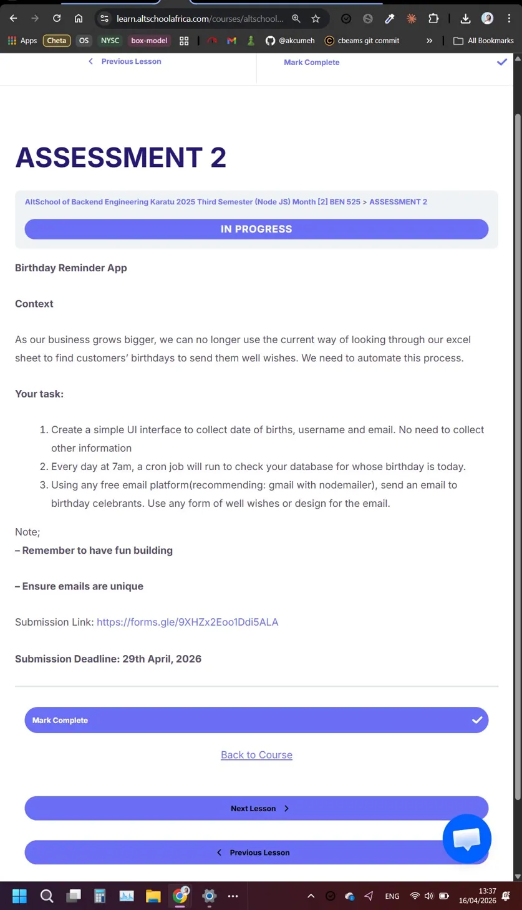

# Birthday Reminder App - AltSchool Assignment

A simple birthday reminder application built with Node.js, Express, and TypeScript. Users register with a username, email, and date of birth. Every day at 7am, a cron job queries the database and sends a personalised birthday email via Gmail to the celebrant(s) for the day.

.

## Features

- Simple registration form that collects username, email, and date of birth.
- Checks for email uniqueness at the database and API level.
- Daily cron job at **7 AM** to check all birthdays today.
- Personalised HTML birthday email sent to celebrants via Gmail with **Nodemailer**.

## Tools Used

- **Backend**: Node.js, Express.js, TypeScript
- **Database**: Supabase (PostgreSQL)
- **Scheduling**: node-cron
- **Email**: Nodemailer with Gmail
- **Testing**: Jest

## Local development
### Prerequisites

- Node.js (v18 or higher)
- npm
- A [Supabase](https://supabase.com) project (free tier works)
- A Gmail account with an [App Password](https://myaccount.google.com/apppasswords) enabled.

### Installation

1. Clone the repository
```bash
git clone https://github.com/akcumeh/altschool-s03-a02.git
cd altschool-s03-a02
```

2. Install dependencies
```bash
npm install
```

3. Create environment file
```bash
cp .env.example .env
```

4. Configure environment variables in `.env`
```env
PORT=3000
SUPABASE_URL=your_supabase_project_url
SUPABASE_PUBLISHABLE_KEY=your_supabase_publishable_key
EMAIL_USER=your_gmail_address@gmail.com
EMAIL_PASS=your_gmail_app_password
```

5. Create the database table: run the SQL in `src/models/users.sql` in your Supabase dashboard (go to Dashboard > SQL Editor).

## Running the Application

### Development Mode
```bash
npm run dev
```

### Production Mode
```bash
npm run build
npm start
```

The application will be available at `http://localhost:3000`

### Running Tests
```bash
npm test
```

## API Endpoints

### Users
- `POST /api/users` - Register a new user (body: `username`, `email`, `date_of_birth`)

### System
- `GET /health` - Health check

-----

## Author

- GitHub - [Angel Umeh](https://github.com/akcumeh)
- Twitter - [@akcumeh](https://x.com/akcumeh)
